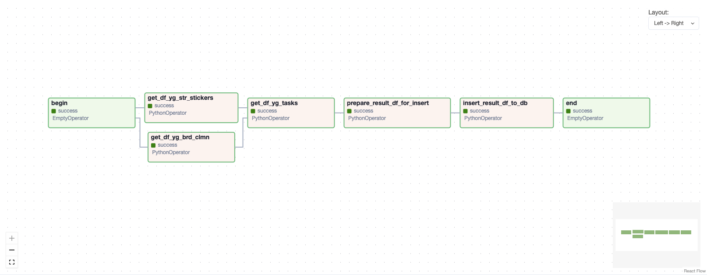

# YouGile ETL Pipeline

## Описание
ETL-пайплайн на базе DAG Apache Airflow для выгрузки данных из [YouGile](https://ru.yougile.com/), их обработки и сохранения в витрину PostgreSQL. Данные используются для построения BI-дашборда

## Структура проекта
- **dags/**: DAG Apache Airflow
- **sql/**: SQL скрипт для создания витрины

## Оссобенности
- Предполагается, что в YouGile все задачи ведутся в формате "Задача с подзадачами"
- Как у задач, так и поздач есть свой набор уникальных параметров (сущности на уровне YouGile), которые нужно сохранять в витрину PostgreSQL

## Общая схема работы ETL

1. `begin` - пустой оператор старт

2. `get_df_yg_stickers` - загрузка справочников (текстовые стикеры) из API YouGile

3. `get_df_yg_brd_clmn` - загрузка досок и колонок из API YouGile

4. `get_df_yg_tasks` - загрузка задач из API YouGile

5. `prepare_result_df_for_insert` - на базе загруженных данных подготавливается результирующий датафрейм для последующей загрузки в витрину PostgreSQL

6. `insert_result_df_to_db` - загрзука в витрину PostgreSQL

7. `end` - пустой оператор финиш
